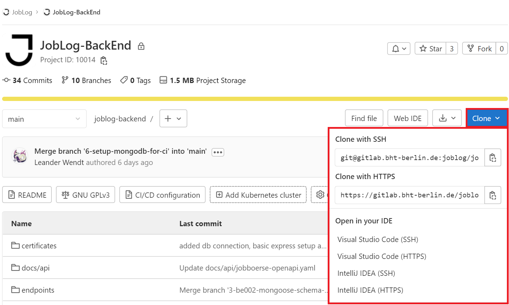
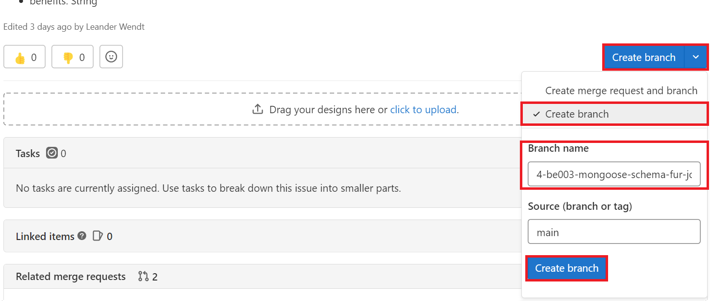
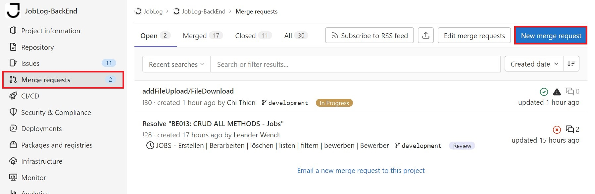
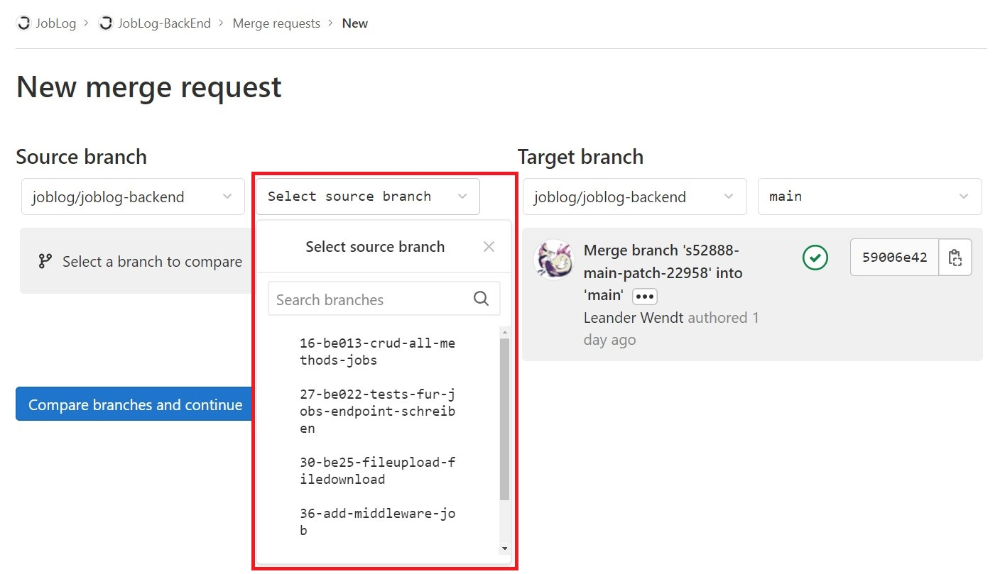
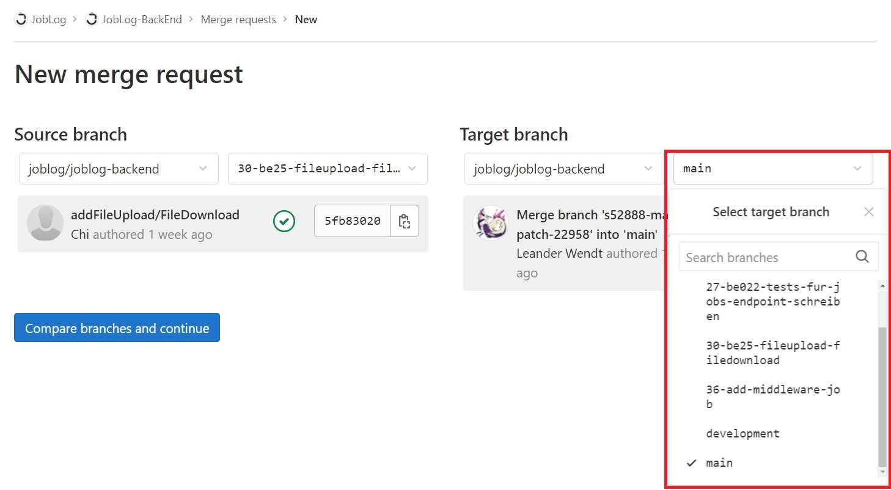
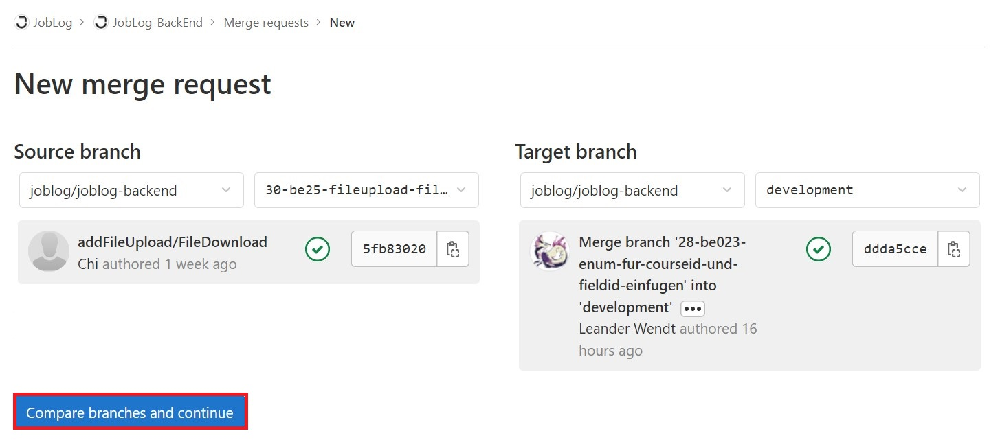
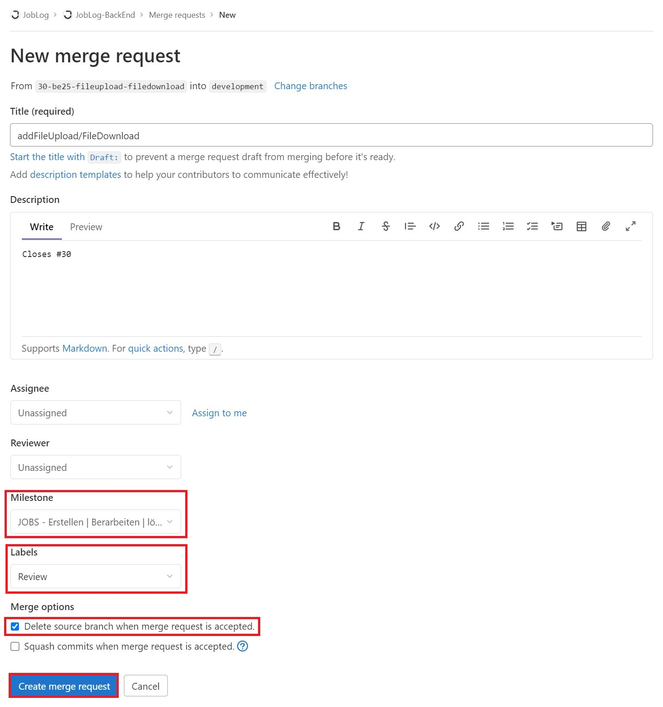

**Inhaltsverzeichnis**

[[_TOC_]]

# Clone

Das Projekt kann im Front- oder Backend-Bereich über SSH oder HTTPS wie folgt geklont werden:

<kbd>

</kbd>

# Branch

Sobald einem Teammitglied ein Issue zugeordnet wurde, kann hierzu über das jeweilige Ticket ein neuer Branch erstellt werden:

<kbd>

</kbd>

# Merge Request

Nachdem ein Ticket bearbeitet und der Code in das Remote Repository gepusht wurde, kann ein neuer Merge Request wie folgt über die linken Navigationsleiste erstellt werden:

<kbd>

</kbd>
 
 

Anschließend muss der jeweilige Source und Target Branch (immer in: **_development_**) ausgewählt und verglichen werden:

<kbd>

</kbd>
 
 
<kbd>

</kbd>
 
 
<kbd>

</kbd>

 Zu guter Letzt kann die Beschreibung angepasst (_nicht zwingend notwendig_), der Milestone zugeordnet, das Label auf **„Review“** und die die Option **„Delete source branch when merge request is accepted.“** gesetzt werden:

<kbd>

</kbd>

  Bei einem erstellten Merge-Request muss ein weiterer Entwickler **„approven“**, damit der Code final in den Main-Branch gemerged wird.