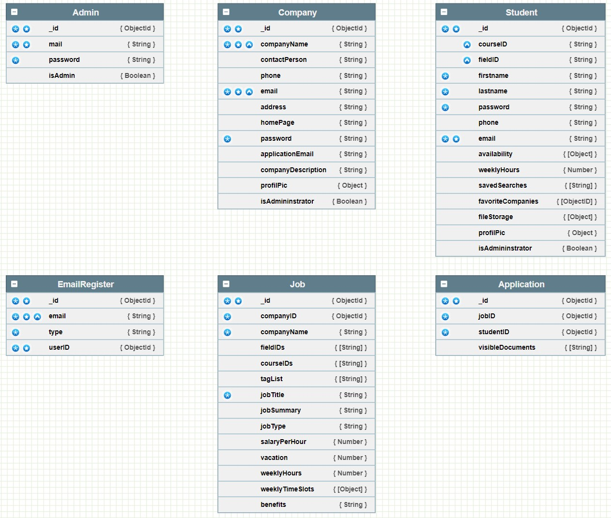

**Inhaltsverzeichnis**

[[_TOC_]]

### **DB Schema**

Die Modellierung der Datenbank-Struktur wurde online über https://nosqldbm.ru/ realisiert.

<kbd>

</kbd>

 Mit folgender XML-Datei kann das Schema auf der Webseite geöffnet und bearbeitet werden: [DB-Schema.xml](uploads/d98ef661c99788cfe659279f3cce204a/DB-Schema.xml)

### **Klassendiagramm**

<kbd>

</kbd>