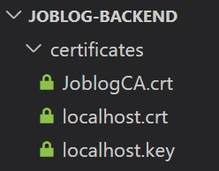
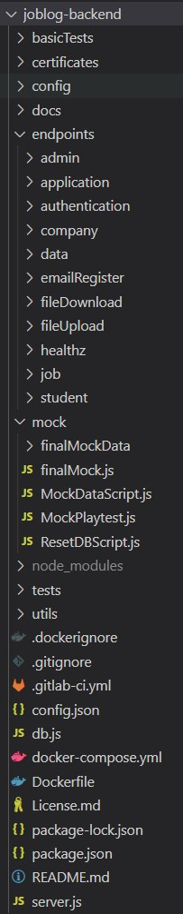
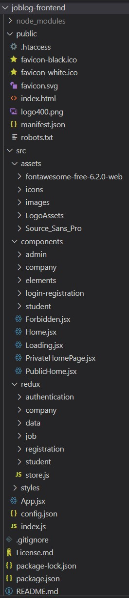
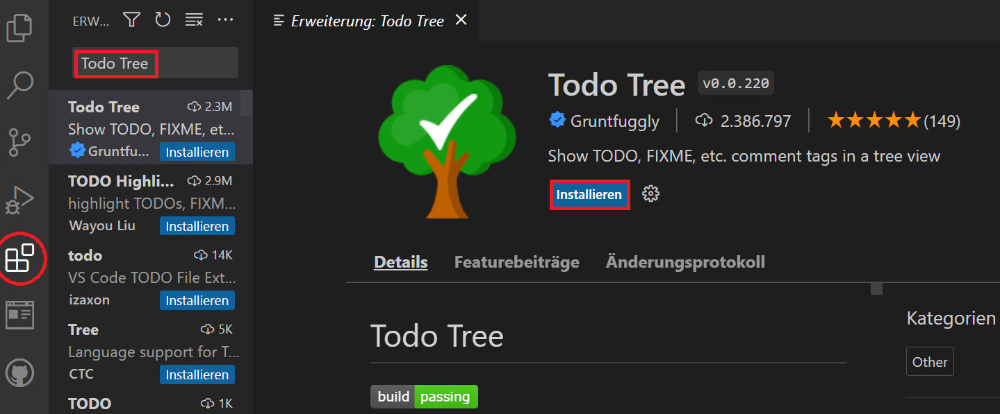

**Inhaltsverzeichnis**

[[_TOC_]]

# IDE

Als Entwicklungsumgebung nutzt unser Team [**Visual Studio Code**](https://code.visualstudio.com/) (_VSC_).

# Node.js

Als plattformübergreifende Laufzeitumgebung muss separat [**Node.js**](https://nodejs.org/de/) (_Version 18.12.0 LTS oder neuer_) installiert werden. Ältere Versionen können ohne Garantie auch funktionieren.

Nach der Installation von Node.js kann der Package-Manager (_npm_) mit folgenden Befehlen im Terminal verwendet werden:

* Auflösung aller Abhängigkeiten (_im Projekt einsehbar unter **package.json**_), die im Projekt benötigt werden:

```
npm install
```

* Starten des Projektservers:

```
npm start
```

oder über

```
node .\server.js
```

Bei einem erfolgreichen Start sollte die Ausgabe wie folgt aussehen:

```
starting API server...
Connected to database mongodb://localhost:27017/Joblog
database connection established 
API Server listening on port 443
```

Der Server antwortet standardmäßig auf den **Port 443**. Sollte der Port belegt sein, kann im Projekt unter **_server.js_** die Konstante **„port“** manuell auf eine andere Portnummer umkonfiguriert werden.

# <span dir="">Nodemon</span>

Ein hilfreiches Modul zum automatisierten Serverneustart ist [**nodemon**](https://nodemon.io/). Hierbei werden Änderungen am Code festgestellt und Node.js automatisiert neu gestartet.

* Installation:

```
npm install -g nodemon
```

Anschließend wird der Server nicht mehr anhand _npm start_ gestartet, sondern über folgenden Befehl:

```
nodemon
```

Bei einem erfolgreichen Start sollte die Ausgabe wie folgt aussehen:

```
[nodemon] 2.0.15
[nodemon] to restart at any time, enter `rs`
[nodemon] watching path(s): *.*
[nodemon] watching extensions: js,mjs,json
[nodemon] starting `node server.js`
starting API server...
Connected to database mongodb://localhost:27017/Joblog
database connection established
```

Über den Shortcut **STRG+C** bzw. **CTRL+C** kann der Server beendet werden.

# MongoDB

Für unser Projekt wird die dokumentenorientierte NoSQL-Datenbank [**MongoDB**](https://www.mongodb.com/de-de) genutzt. Hierzu muss der [**MongoDB Community Server**](https://www.mongodb.com/try/download/community) heruntergeladen und unter Windows installiert werden.

Anschließend muss unter Windows das Verzeichnis **„/data/db“** angelegt werden.

Im VSC-Projekt wird zusätzlich das Client-Modul/Driver installiert:

```
npm install mongodb
```

Zu guter Letzt muss unter Windows **mongod.exe** gestartet werden (**nicht mongo.exe**), damit der Server eine Datenbankanbindung herstellen kann. Das erscheinende Fenster der _mongod.exe_ sollte während der Verwendung der Datenbank nicht geschlossen werden!

Die Konfiguration der Datenbank kann im Projekt unter **_config.json_** eingesehen werden.

# Mongoose

Für einen vereinfachten Zugriff von Objekten in MongoDB verwenden wir in unserem Projekt [**Mongoose**](https://mongoosejs.com).

```
npm install mongoose
```

# Zertifikat

Für all unsere REST-Services nutzen wir HTTPS. Für die Entwicklung wurde zunächst ein eigenes Server-Zertifikat erstellt.

Die RootCA **„JoblogCA.crt“** kann im Projekt-Ordner **_certificates_** eingesehen und lokal installiert werden.

<kbd>

</kbd>

<br>Anleitungen zum installieren von eigenen RootCA Zertifikaten: [Mac](https://www.eduhk.hk/ocio/content/faq-how-add-root-certificate-mac-os-x) [Windows](https://docs.vmware.com/en/VMware-Adapter-for-SAP-Landscape-Management/2.1.0/Installation-and-Administration-Guide-for-VLA-Administrators/GUID-D60F08AD-6E54-4959-A272-458D08B8B038.html) [Linux](https://askubuntu.com/questions/73287/how-do-i-install-a-root-certificate)

# Verzeichnis- und Modulstruktur

Die Projektstruktur des Backend-Servers sieht (_Stand: 03.02.2023_) wie folgt aus:

<kbd>

</kbd>


<br>Die Projektstruktur des Frontend-Servers sieht (_Stand: 03.02.2023_) wie folgt aus:

<kbd>

</kbd>

<br>Das zentrale Server-Modul heißt **_server.js_**. 

Alle Endpoints befinden sich im Verzeichnis **„endpoints“** mit entsprechenden Unterverzeichnissen. In den einzelnen Endpoints gibt es eine Express-Route (_z. B. AdminRoutes.js_), diese greift auf ein Service-Modul (_z. B. AdminService.js_) zu, welches das jeweilige Mongoose-Modell (_z. B. AdminModel.js_) verwendet.

# Todo Tree

Zur Unterstützung der Übersichtlichkeit von offenen To-Dos und Fixes im Projekt kann die Erweiterung **[Todo Tree](https://marketplace.visualstudio.com/items?itemName=Gruntfuggly.todo-tree)** über den _VSC Marketplace_ installiert werden.

<kbd>

</kbd>

<br>To-Dos und Fixes können im Code anhand folgender Tags angelegt werden:
```
//TODO
//FIXME
```

Anschließend können alle Tags in der Todo Tree Erweiterung übersichtlich entnommen und abgearbeitet werden. 

<kbd>

</kbd>