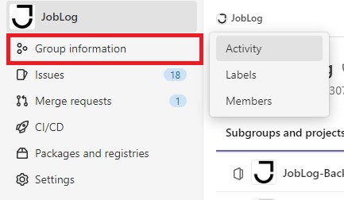

**Inhaltsverzeichnis**

[[_TOC_]]

# Issues / Tickets

## Struktur

Issues / Tickets (die Features beinhalten) werden nach folgendem Schema erstellt:

- Benennung des Bereiches
  - **BE** = Backend
  - **FE** = Frontend
  
- Fortlaufende Nummerierung pro Bereich
  - BE**001**:
  - BE**002**:
  - FE**001**:
  - FE**002**
  
- Aussagekräftiger Titel
  - BE001: **username aus Studentschema entfernen**
  - FE001: **MOCK Modal Profil Vervollständigung Student**
  
- Beschreibung
  - Kurzer Beschreibungstext der Aufgabe \
    **Erstellung eines Mocks in Figma für das Modal bei der Profilvervollständigung bei Studenten als Arbeitsgrundlage. Figma**

  - Angabe von Akzeptanzkriterien (To-Dos / Tasks)
    * [x] **username aus Studentenschema entfernen**
    * [x] **Studentenschema email + password auf required setzen**
    * [ ] **Openapi aktualisieren**
    
- Linked Items
  - **Abhängige Tickets**
  - **Mockups**
  - **Unterstützende Links / URLs**

## Eigenschaften

Folgende Eigenschaften werden zur Einordnung verwendet:

- Assignee
  * Zuweisung eines Bearbeiters
  
- Labels
  * Blocker = Zuweisung bei bestehenden Fehlern
  * In Progress = Zuweisung bei aktiver Bearbeitung
  * Notes & Ideas = Zuweisung bei Ideenfindung
  * Review = Zuweisung bei benötigter Überprüfung (_vor einem Merge_)
  * Test = Zuweisung bei Testphase
  
- Milestone
  * Zuweisung eines Meilensteins

## Boards

Für eine effektivere Bearbeitung von Tickets wird die Boards-Ansicht empfohlen.
- In der linken Navigationsleiste über _Issues_ hovern oder den Link: https://gitlab.bht-berlin.de/groups/joblog/-/boards nutzen.
<kbd>

</kbd>
 
 
<kbd>

</kbd>

# Activity

Für eine Übersicht der aktuellen Projektaktivitäten wird die Activity-Ansicht empfohlen.
- In der linken Navigationsleiste über _Group information_ hovern oder den Link: https://gitlab.beuth-hochschule.de/groups/joblog/-/activity nutzen.
<kbd>

</kbd>
 
 
<kbd>

</kbd>

# Graph

Für eine Übersicht der aktuellen Branching-Workflows wird die Graph-Ansicht empfohlen.
- In der linken Navigationsleiste des jeweiligen Projektes über _Repository_ hovern oder den Link: https://gitlab.beuth-hochschule.de/joblog/joblog-backend/-/network/main bzw. https://gitlab.beuth-hochschule.de/joblog/joblog-frontend/-/network/main nutzen.
<kbd>

</kbd>
 
 
<kbd>

</kbd>
