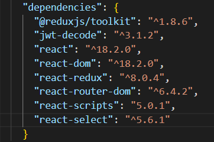

**Inhaltsverzeichnis**

[[_TOC_]]

## Projektbeschreibung

Ziel dieses Projekts ist es, den Kommunikationsfluss zwischen Unternehmen und Studierenden im Kontext der Jobsuche und Jobangeboten zu vereinfachen und übersichtlicher zu gestalten. Die von der BHT genutzte Lösung bietet grundlegend schon die Möglichkeit, dass Unternehmen ihre Stellengesuche einstellen können und Suchende die Jobs filtern können. Unsere Jobbörse soll den gesamten Prozess der Arbeitssuche für Arbeitnehmer_innen und Arbeitgeber_innen optimieren. Jobangebote sollen sich an bestimmte Studiengänge richten, sowie über tag-basierte Suche personalisierte Ergebnisse bringen. Studierende sollen in der Lage sein, ihre zeitlichen Kapazitäten anzugeben, wodurch das Zeitmanagement zwischen Arbeit und Studium vereinfacht werden soll. Der Bewerbungsprozess soll durch Upload-Funktionen in den Stellenanzeigen direkter und unkomplizierter gestaltet werden, so dass Bewerbungsunterlagen über das Portal gesendet werden können.

## Features

* Progressive Web App
* minimalistisches, simples und übersichtliches Design
* filtern nach Jobs/Studenten
* Jobangebote zugeschnitten für Studiengänge
* Zeitangabe der studentischen Kapazität
* Schlagwort- und zeitbasierte Jobsuche
* Upload-Funktion der Bewerbungsunterlagen direkt in der Stellenanzeige

## Art des Projektes

Progressive Web App (PWA): “Eine Progressive Web App ist eine Website, die zahlreiche Merkmale besitzt, die bislang nativen Apps vorbehalten waren. Sie kann daher auch als Symbiose aus einer responsiven Webseite und einer App beschrieben werden.” Quelle: https://de.wikipedia.org/wiki/Progressive_Web_App

## Tech Stack

### Back-End

* Javascript
* Node.js (Framework: Express)
* Datenbank:
  * MongoDB
  * Mongoose (MongoDB - Objektmodellierungstool)
* Tests:
  * Mocha
  * PactumJS

### Front-End

* Javascript
* React
* Redux (State Manager)
* HTML
* CSS
* Apache (Webserver)

### **Versionen der benutzen Technologien**

**Frontend**

<kbd>

</kbd>

 **Backend**

<kbd>

</kbd>

## Teilnehmer\*innen

* Nadine Brandes (916887) - Teamlead Frontend | UI/UX Designer | Testing
* Gerrit Behrens (918257) - Supervisor Backend & Frontend​ | Coding Frontend | Testing
* Leander Wendt (921663) - Teamlead Backend | Coding Backend | Testing
* Chi Thien Pham (922567) - Coding Backend | Testing | Dokumentation
* Jonas Spaller (925041) - Coding Backend & Frontend | Deployment | Testing
* Matthias Czernia (925042) - Coding Backend | Testing | Dokumentation

## Zeitplan

* 06.10.22 - Brainstorming: Themafindung
* 13.10.22 - Bearbeitung Projektbeschreibung
* 20.10.22 - Organisation & Bekanntgabe Pitch
* 27.10.22 - Fertigstellung Pitch & Präsentation
* 03.11.22 - Festlegung Milestone, Anlegung Projekt- & Developerdokumentation
* 10.11.22 - Umstrukturierung Teamorganisation & Kommunikation
* 17.11.22 - Besprechung Matching-Systems
* 24.11.22 - Online - Aktualisierung DB-Schema & Wiki
* 01.12.22 - Priorisierung Features & Issues - "aufräumen"
* 08.12.22 - Bekanntgabe PlayTest, Erstellung Testpläne & Umfragebogen
* 15.12.22 - Vorbereitungen PlayTest
* 22.12.22 - PlayTest - vorzeigbarer Prototype mit interaktiver Oberfläche (Kernidee)
* 05.01.23 - PlayTest Auswertung: Beobachtung / Umfragen, Ausblick letzter Milestone
* 12.01.23 - Informationen zur Abschlusspräsentation
* 19.01.23 - Vorbereitung Abschlusspräsentation
* 26.01.23 - Letztes Feedback Projekt, Klärung offener Fragen (Abschlusspräsentation)
* 02.02.23 - Abschlusspräsentation Part 1
* 09.02.23 - Abschlusspräsentation Part 2
* 16.02.23 - Ggf. Nachgespräch

## Meetings & Kommunikation

* Supervisor BE / FE: Gerrit Behrens (Nadine Brandes, Leander Wendt) - Montags, 11:00 Uhr.
* Teamlead BE: Leander Wendt (Matthias Czernia, Chi Thien Pham) - Dienstags, 15:00 Uhr.
* Teamlead FE: Nadine Brandes (Gerrit Behrens, Jonas Spaller) - Mittwochs, 11:00 Uhr.
* Teammeeting: Alle - Donnerstags, 13:15 Uhr mit Betreuer in Präsenz, mit anschließenden internen Team-Besprechungen

#### Kommunikationsart

* Discord - Supervisor Meetings & Teamlead Meetings BE | FE
* Whatsapp - für einzelne Absprachen zwischen den Mitgliedern

#### Versionskontrollsystem

* GitLab

## Projektplanung

### User Story

* Student:
  * US#101: Als studierende Person möchte ich Jobangebote sehen.
  * US#102: Als studierende Person möchte ich mich auf Jobangebote bewerben können.
  * US#103: Als studierende Person möchte ich mich registrieren können.
  * US#104: Als studierende Person möchte ich mein Profil erstellen können.
  * US#105: Als studierende Person möchte ich mein Profil bearbeiten können.
  * US#106: Als studierende Person möchte ich mein Profil sehen.
  * US#107: Als studierende Person möchte ich mein Profil löschen können.
  * US#108: Als studierende Person möchte ich meine Bewerbungsunterlagen zu meinem Profil hinzufügen können.
  * US#109: Als studierende Person möchte ich meine möglichen Arbeitszeiten/Tage hinterlegen können.
  * US#110: Als studierende Person möchte ich Jobangebote suchen können.
  * US#111: Als studierende Person möchte ich bei der Suche filtern können.
  * US#112: Als studierende Person möchte ich meine Suchfilter speichern können.
  * US#113: Als studierende Person möchte ich Jobvorschläge zu meinem Profil bekommen.
  * US#114: Als studierende Person möchte ich Unternehmen favorisieren können.
  * US#115: Als studierende Person möchte ich mit den Unternehmen direkt kommunizieren können.
* Unternehmen:
  * US#201: Als Unternehmen möchte ich mich registrieren.
  * US#202: Als Unternehmen möchte ich ein Profil erstellen.
  * US#203: Als Unternehmen möchte ich mein Profil einsehen.
  * US#204: Als Unternehmen möchte ich mein Profil bearbeiten.
  * US#205: Als Unternehmen möchte ich mein Profil löschen.
  * US#206: Als Unternehmen möchte ich ein Stellenangebot erstellen.
  * US#207: Als Unternehmen möchte ich meine Stellenangebote einsehen.
  * US#208: Als Unternehmen möchte ich alle Stellenangebote einsehen.
  * US#209: Als Unternehmen möchte ich ein Stellenangebot bearbeiten.
  * US#210: Als Unternehmen möchte ich ein Stellenangebot löschen.
  * US#211: Als Unternehmen möchte ich alle Bewerbungen auf ein Stellenangebot einsehen.
  * US#212: Als Unternehmen möchte ich eine Bewerbung ablehnen.
  * US#213: Als Unternehmen möchte ich eine Bewerbung annehmen.
  * US#214: Als Unternehmen möchte ich ein Studierendenprofil ansehen.
  * US#215: Als Unternehmen möchte ich Unternehmensprofile ansehen.
  * US#216: Als Unternehmen möchte ich mit den Studierenden direkt kommunizieren können.
  * US#217: Als Unternehmen möchte ich Studierende favorisieren können.
* Admin:
  * US#301: Als Admin möchte ich unangemessene Inhalte löschen.
  * US#302: Als Admin möchte ich Profile erstellen können.
  * US#303: Als Admin möchte ich Profile bearbeiten können.
  * US#304: Als Admin möchte ich Profile löschen können.
  * US#305: Als Admin möchte ich Profile sehen können.

### Endpoints

**_Jobs:_**

* **READ / GET:**
  * /jobs --> getAllJobs (ungefiltert)
  * /jobs/{jobID} --> getJobByID (gibt ein spezifisches Jobangebot zurück)
  * /jobs/{fieldID} --> getAllJobsByFieldID (gefiltert nach Fachbereich)
  * /jobs/{courseID} --> getAllJobsByCourseID (gefiltert nach Studiengang)
  * /jobs/{companyID} --> getAllJobsByCompanyID (gefiltert nach Unternehmen)
* **CREATE / POST:**
  * /jobs
    * Header: Bearer Token... (e.g. companyID)
    * Body:
      * fieldIDs
      * courseIDs
      * tagList - (Help the search, Skills etc.)
      * jobTitle
      * jobSummary
      * jobType - (e.g working student, internship, full Times)
      * salaryPerHour
      * vacation
      * workTimeAmount
      * mandatoryPresenceTime
      * benefits
* **UPDATE / PUT:**
  * /jobs/{jobID}
    * Header: Bearer Token... (e.g. companyID)
    * Body:
    * fieldIDs
    * courseIDs
    * tagList - (Help the search, Skills etc.)
    * jobTitle
    * jobSummary
    * jobType - (e.g working student, internship, full Times)
    * salaryPerHour
    * vacation
    * workTimeAmount
    * mandatoryPresenceTime
    * benefits
* **DELETE / DELETE:**
  * /jobs/{jobID}
    * Header: Bearer Token... (e.g. companyID, isAdmin=true)

**_S__tudents_**

* **READ / GET:**
  * /students --> getAllStudents
  * /students/{studentID} --> getStudentByID
  * /students/{fieldID} --> getStudentsByFieldID
  * /students/{courseID} --> getStudentsByCourseID
* **CREATE / POST:**
  * /students
  * Header: Authorisierung?
  * Body:
    * courseID
    * fieldID
    * username - public/email... ???
    * firstname
    * lastname
    * password
    * phone - not required
    * email
  * **UPDATE / Put:**
    * /students/{studentID}
    * Header: Bearer Token... (e.g. studentID, isAdmin=true)
    * Body:
      * courseID
      * fieldID
      * username
      * - public/email... ???
      * firstname
      * lastname
      * password
      * phone
      * email
      * availability - (Key-Value?)
      * savedSearches - (List with saved filters and search bar content)
      * favoriteCompany - (List with company profil IDs)
      * fileStorage - (List with pdfs)
* **DELETE / DELETE:**
  * /students/{studentID}
  * Header: Bearer Token... (e.g. companyID, isAdmin=true)

**_C__ompanies_**

* **READ / GET:**
  * /companies --> getAllCompanies
  * /companies/{compnayID} --> getCompanyByID
* **CREATE / POST:**
  * /companies
  * Body:
    * companyName
    * password
    * contactPerson - (Name of the person)
    * phone - required
    * email - required
    * adress (street, number, postal code, city, country) - required
    * homePage
    * applicationEmail - ??? (Bei Dokumentenfreigabe und (Downloadoption) nicht nötig)
    * companyDescription
* **UPDATE / PUT:**
  * /companies/{companyID}
  * Header: Bearer Token...
  * Body:
    * companyName
    * password
    * contactPerson - (Name of the person)
    * phone
    * email
    * adress (street, number, postal code, city, country)
    * homePage
    * applicationEmail
    * companyDescription
* **DELETE / DELETE:**
  * /companies/{companyID}
  * Header: Bearer Token... (e.g. companyID isAdmin=true)

**_Management_** (Zur Pflege der Listen (Studiengang, Fachbereich))

* **READ / GET:**
  * /management/fields --> getAllFields (fieldID, description)
  * /management/fields/{fieldID} --> getFieldByFieldID
* **CREATE / POST:**
  * /management/fields
  * Header: Bearer Token (isAdmin=true)
  * Body: description
* **UPDATE / PUT**
  * /management/fields/{fieldID}
  * Header: Bearer Token (isAdmin=true)
  * Body: description
* **DELETE / DELETE:**
  * /management/fields/{fieldID}
  * Header: Bearer Token (isAdmin=true)

**_M__anagement_**

* **READ / GET:**
  * /management/courses --> getAllCourses (courseID, description)
  * /management/courses/{courseID} --> getCourseByCouresID
* **CREATE / POST:**
  * /management/courses
  * Header: Bearer Token (isAdmin=true)
  * Body: description
* **UPDATE / PUT**
  * /management/courses/{courseID}
  * Header: Bearer Token (isAdmin=true)
  * Body: description
* **DELETE / DELETE:**
  * /management/courses/{courseID}
  * Header: Bearer Token (isAdmin=true)

### LDAP BHT

Recherche zur Anbindung des Logins über das LDAP der BHT mit Herrn Prof. Dr. Peter Tröger führte zu folgendem Ergebnis: Es gäbe theoretisch drei Varianten zur Realisierung. Das Rechenzentrum der BHT ist jedoch technisch für zwei Varianten noch nicht umsetzungsfähig. Die dritte Variante würde den Austausch der Benutzerkennung im Klartext beinhalten, was unsere Gruppe einstimmig aus Sicherheitsaspekten ablehnt.

## Schichten Architektur

**Allgemeine Architektur**

<kbd>

</kbd>

 **Frontend**

<kbd>

</kbd>

 **Backend**

<kbd>

</kbd>

## Herausforderung & Erkenntnisse

* Herausforderung:
  * Teamstruktur und Zuständigkeiten
  * Verwirrung in den Aufgabenzuteilungen
* Erkenntnisse(negativ):
  * "Ich mache mal, wie ich denke"
  * "Teamstruktur ist wichtig"
  * "Einfach mal schnell coden"
  * "Betriebsblindheit"
* Erkenntnisse(positiv):
  * Einteilung der Aufgaben nach individuellen Stärken
  * Selbstständiges Arbeiten
  * Wissensaustausch innerhalb der Gruppe bei offenen Fragen
  * Kommunikation auf Augenhöhe

## Ausblick - Future Work

* Chatfunktion - zwischen Studenten & Company
* Error Handling - beim Ausfall des Backends
* Jobsuche - per Schlagwörter
* Account Verifizierung - per Mail bestätigen
* Cookiebanner - Akzeptieren beim Login oder Registrieren
* "Passwort vergessen" Funktion